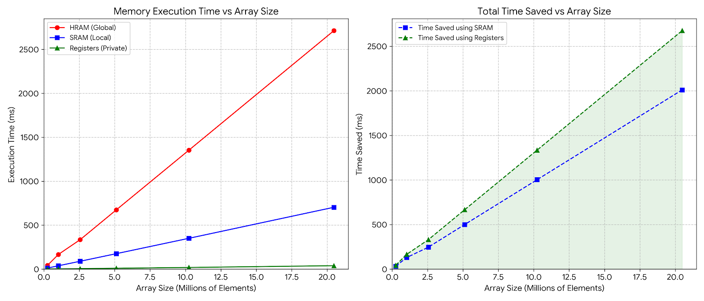
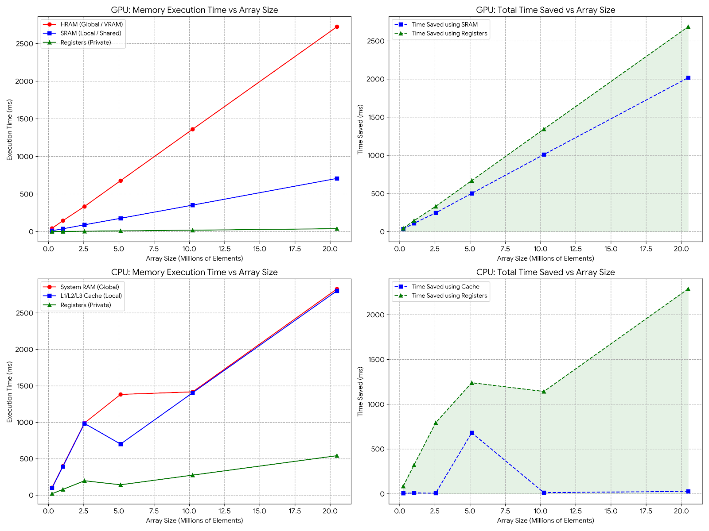

# Inference Acceleration: OpenCL Hardware Foundations

Modern LLM inference on consumer hardware is usually memory-bound before it is compute-bound. This section maps that bottleneck directly to OpenCL memory tiers, then validates it with measured benchmarks.

## Why This Section Exists

Most optimization discussions start at frameworks. This section starts lower, at the hardware boundary, where model weights and KV cache movement dominate latency and power on laptops, mobiles, and SoCs.

OpenCL is used here because it is vendor-portable across CPUs, GPUs, and accelerators. The objective is to understand what the device actually exposes, then shape kernel strategy around those physical limits instead of guessing.

## OpenCL Memory Hierarchy Primer

OpenCL exposes a strict memory hierarchy. Kernel performance is mostly a logistics problem: how long data stays close to compute.

| Tier | Typical Capacity | Latency/Speed | Scope | LLM Implication |
| --- | --- | --- | --- | --- |
| Host Memory (CPU RAM) | 4-32+ GB | Slowest path to device | System-wide | Large weights live here initially; transfers are expensive. |
| Global Memory (VRAM/HRAM) | 0.25-12+ GB | High latency vs on-chip | Device-wide | Main model storage during inference; repeated reads cause stalls. |
| Local Memory (SRAM) | 16-48 KB per CU/work-group | Much faster | Shared per work-group | Tiling target for reuse; key to reducing global traffic. |
| Private Memory (Registers) | Bytes to small KB per thread | Fastest | Per work-item | Arithmetic hot path; maximize time spent here. |

Practical rule: move data from global memory into local memory in reusable tiles, then do as much arithmetic as possible in registers before writing back.

## OpenCL Software Hierarchy (Control Path)

Execution also follows a strict hierarchy:

- `Platform`: vendor OpenCL runtime implementation (NVIDIA/AMD/Intel).
- `Device`: physical compute target (CPU/GPU/accelerator).
- `Context`: container for devices, memory objects, and programs.
- `CommandQueue`: submission path for transfers, kernel launches, and sync.

This repository starts by querying these layers so later kernel choices can be tied to concrete device limits.

## Phase I: Hardware Handshake (`cl_info.cpp`)

File: [`src/cl_info.cpp`](./src/cl_info.cpp)

The handshake collects execution resources, memory limits, and precision/vectorization signals:

- Work-group and work-item limits for NDRange shape.
- Global/local memory sizes and max alloc for buffer planning.
- UMA status for transfer strategy.
- FP16/vector width hints for data type and packing choices.

### Sample Device Capability Snapshot

Sample output from this repo's documented run:

| Metric | Value |
| --- | --- |
| Device | NVIDIA GeForce RTX 3060 Laptop GPU |
| Compute Units | 30 |
| Max Work-Group Size | 1024 threads |
| Max Work-Item Sizes (X/Y/Z) | 1024 x 1024 x 64 |
| Global Memory | 6143 MB |
| Local Memory (SRAM) | 48 KB |
| Max Single Buffer | 1535 MB |
| UMA | NO (Discrete VRAM) |
| Preferred Float Vector Width | 1 |
| Preferred Half Vector Width | 0 |
| Native FP16 Support (OpenCL-reported) | NO |

### What This Implies for Kernel Design

- Tile sizes must fit local memory hard limits.
- Work-group sizing should balance occupancy and register pressure.
- Large model weights may require explicit chunking due to max alloc limits.
- Driver-reported vector/FP16 capabilities can differ from raw hardware expectations, so validate on the actual runtime path you use.

## Engineering Translation: Specs -> Kernel Strategy

Given 48 KB local memory:

- `48 KB = 49,152 bytes`
- `49,152 / 4 = 12,288 float32 values total`
- For two tiles (A and B): `12,288 / 2 = 6,144 floats per tile`
- `sqrt(6,144) = 78.3`, so a safe power-of-two square tile is typically `64x64`

If tile choices exceed local memory, kernels can fail with resource errors (for example, `CL_OUT_OF_RESOURCES`).

For execution shape, maxing threads is not automatically best. Very large work-groups can increase register pressure and reduce effective occupancy. The benchmark code uses a `256` local size (`16x16` style mental model for tiled work) as a practical balance point.

For transfer planning, non-UMA devices and max-buffer caps imply chunked movement for large tensors instead of monolithic buffers.

## Phase 1.5/2: Memory Wall Benchmark

Files:

- [`src/memory_benchmarking.cpp`](./src/memory_benchmarking.cpp)
- [`src/memory_benchmarking_scale.cpp`](./src/memory_benchmarking_scale.cpp)
- [`kernels/memory_bench.cl`](./kernels/memory_bench.cl)

Method summary:

- Sweep element counts from `256,000` to `20,480,000`.
- For each element, execute repeated additions (`10,000` iterations).
- Benchmark three tiers:
  - `benchmark_global` (`__global`)
  - `benchmark_local` (`__local`)
  - `benchmark_private` (register/private path)
- Use `volatile` in kernel paths to reduce aggressive compiler elimination and better expose memory behavior.
- Capture timings via OpenCL profiling events.

### GPU Benchmark Results (`assets/benchmark_results.csv`)

| Elements | HRAM_ms | SRAM_ms | Registers_ms |
| --- | ---: | ---: | ---: |
| 256000 | 43.1268 | 11.5169 | 0.617472 |
| 1024000 | 144.523 | 36.5783 | 1.8729 |
| 2560000 | 334.347 | 90.0413 | 4.62541 |
| 5120000 | 676.961 | 176.437 | 9.3737 |
| 10240000 | 1361.3 | 351.939 | 18.1955 |
| 20480000 | 2723.56 | 706.856 | 38.6253 |

Observations:

- Global-memory time scales steeply with problem size.
- Local-memory path is materially faster across all tested sizes.
- Register/private path remains far lower than both, illustrating how costly off-chip movement is.

### CPU Benchmark Results (`assets/benchmark_results_CPU.csv`)

| Elements | HRAM_ms | SRAM_ms | Registers_ms |
| --- | ---: | ---: | ---: |
| 256000 | 103.031 | 97.9804 | 19.4956 |
| 1024000 | 398.933 | 390.991 | 78.17 |
| 2560000 | 989.662 | 983.516 | 197.14 |
| 5120000 | 1381.68 | 700.725 | 141.868 |
| 10240000 | 1416.68 | 1404.72 | 274.576 |
| 20480000 | 2828.69 | 2802.84 | 541.111 |

Observations:

- The same hierarchy trend appears on CPU runs, though with different magnitudes.
- As working sets grow, time spent waiting on memory dominates arithmetic work.
- The widening gap quantifies idle compute caused by data movement.

## Charts

### Scaling Behavior Across Memory Tiers



This plot highlights the core pattern: global memory scales worst, local memory improves throughput, and register-centric work stays comparatively low.

### CPU vs GPU Memory-Wall Comparison



The cross-device view reinforces that the memory wall is architectural, not framework-specific. Absolute values differ by hardware, but the hierarchy penalty pattern remains.

## Build and Run (Current Repo Reality)

### Prerequisites

- OpenCL headers + ICD loader/runtime
- C++17 compiler
- CMake `3.10+`

### Build `cl_info` via CMake

From repository root:

```bash
cmake -S Hardware -B Hardware/build
cmake --build Hardware/build --config Release
```

Run:

```bash
./Hardware/build/cl_info
```

On Windows (PowerShell):

```powershell
.\Hardware\build\cl_info.exe
```

### Benchmark Executables and CSV Outputs

- Existing binaries are present in `Hardware/build/`:
  - `memory_benchmarking.exe`
  - `memory_benchmarking_scale.exe`
- Benchmark datasets used in this README are stored in:
  - [`assets/benchmark_results.csv`](./assets/benchmark_results.csv)
  - [`assets/benchmark_results_CPU.csv`](./assets/benchmark_results_CPU.csv)

### Caveat

Current [`CMakeLists.txt`](./CMakeLists.txt) defines only `cl_info`. Running or rebuilding benchmark executables may require:

- extending `Hardware/CMakeLists.txt` with benchmark targets, or
- compiling benchmark sources manually while linking OpenCL and including `utils/`.

## Key Takeaways and Next Step

LLM inference performance on consumer devices is constrained primarily by memory movement, not raw arithmetic. The practical optimization target is to move computation from global-memory-heavy execution toward local-memory tiling and register reuse.

Next step: implement and benchmark tiled matrix multiplication kernels that are sized directly from measured local-memory constraints.
