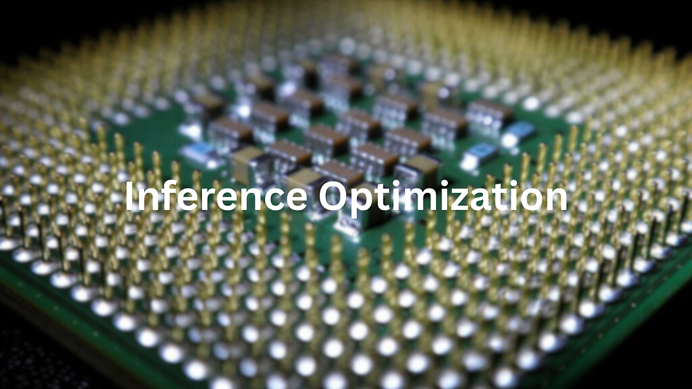
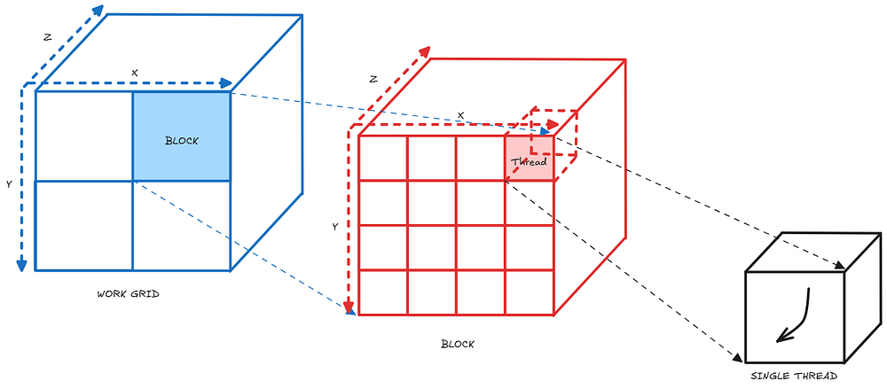
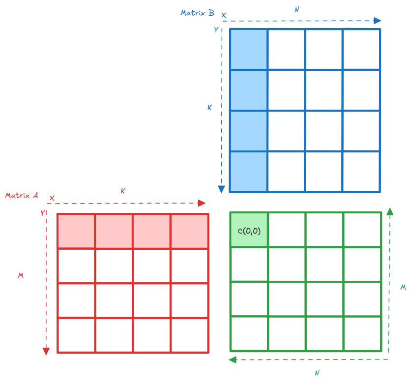
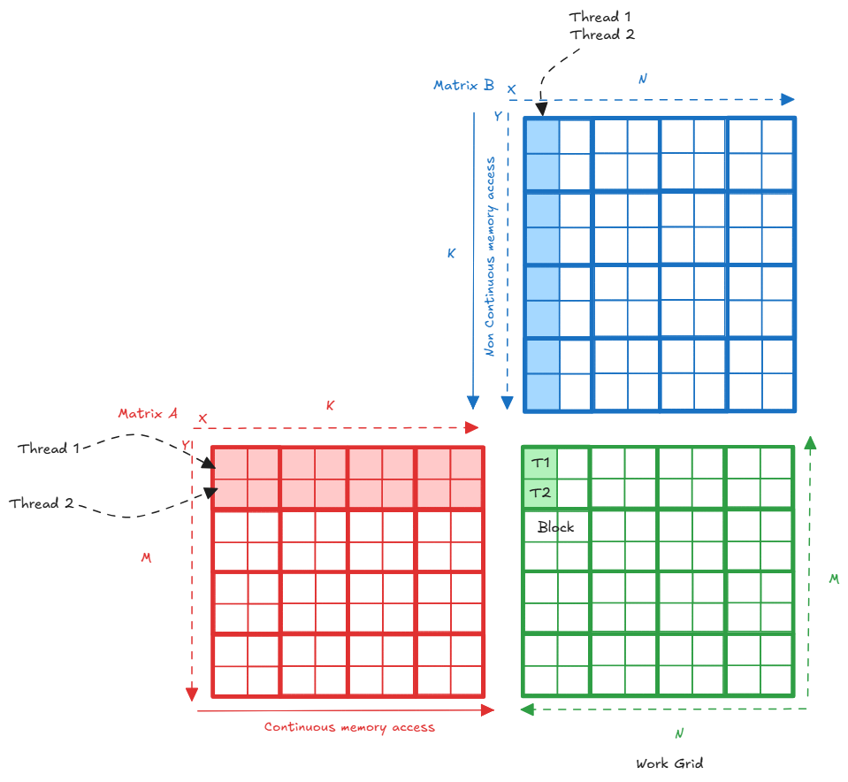
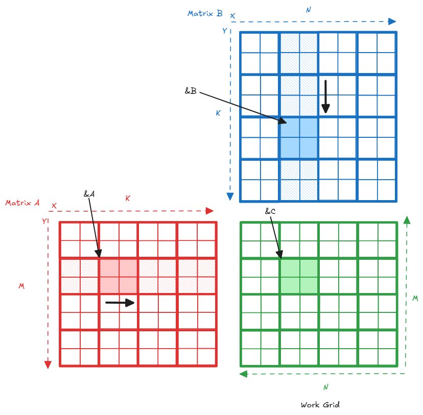
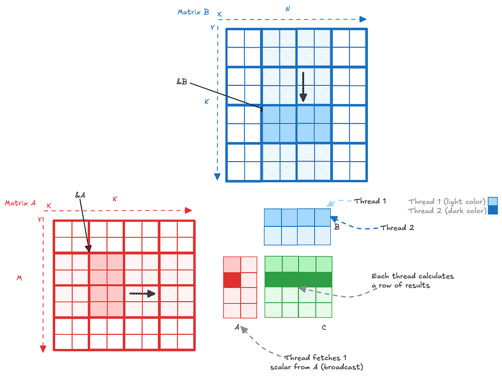
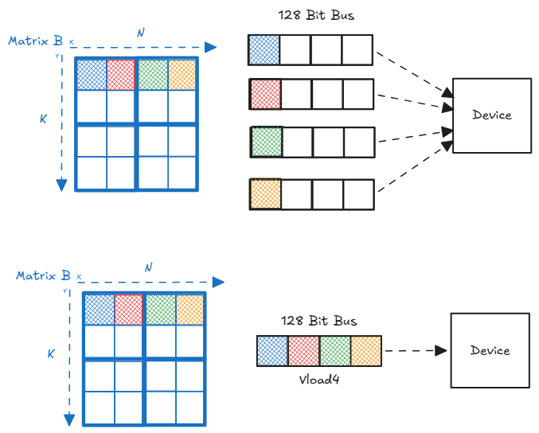
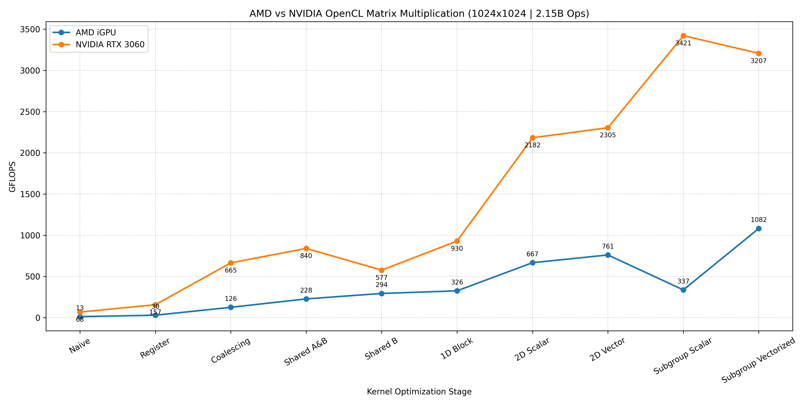

# Inference Optimization



If you look under the hood of any modern LLM, past the attention mechanisms and layer norms, it basically boils down to one thing: Matrix Multiplication (MatMul). It is the undisputed bottleneck for both training and inference.

In my last post, we looked at the physical constraints of the hardware. We talked about the "Memory Wall" the reality that your GPU's math cores spend most of their time sitting idle, starved of data, just waiting for massive weight tensors to be dragged out of VRAM. You can't fix this by just having a faster GPU; you have to write code that explicitly respects the hardware's memory hierarchy.

Today, we are going hands-on. If you search the web for how to do this, you will find a mountain of incredible tutorials dedicated entirely to NVIDIA's CUDA. But there is a glaring gap in the ecosystem: there are almost zero comprehensive guides covering these exact same low-level optimizations in OpenCL. So, I am giving it a try.

I am going to write a MatMul kernel from scratch using OpenCL. We will start with the most naive, unoptimized code possible, and then step-by-step, we will fix it. We'll cover memory coalescing, SRAM tiling, and warp-level register caching until we push the silicon to its absolute limit.

To make things interesting, I am going to benchmark every single optimization stage across two totally different architectures: an integrated AMD Radeon iGPU and a dedicated NVIDIA RTX 3060 for matrices of shape 1024x1024. As you will see, hardware dictates everything, and what is highly optimized for one chip might actually break the other. The aim of this blog is to simply learn, implement, and document the optimization of matmuls.

---

## The GPU Execution Hierarchy

Basic understanding of how the GPU organizes its workforce is crucial before we write our first line of code. When we dispatch a compute job to the GPU, we don't just throw a million threads at it randomly; we organize them into a strict 3D hierarchy:

- **The Work Grid (NDRange in OpenCL):** This represents the entire problem space. If we are multiplying two 1024x1024 matrices, our global grid will have 1,048,576 individual workers.
- **The Block (Work-group in OpenCL):** The GPU chops the massive Work Grid into smaller, manageable chunks called Blocks. Threads inside the same block are special - they can communicate with each other, synchronize their execution, and share ultra-fast SRAM memory.
- **The Single Thread (Work-item in OpenCL):** The individual worker at the bottom of the pyramid. It executes the actual math in our C++ kernel.

The entire dark art of GPU optimization lies in how we manipulate these blocks and threads to share data.



---

## Kernel 1 : The Naive Baseline



The most natural way to perform matrix multiplication is computing each output element as a dot product. In OpenCL, instead of writing nested for loops for the rows and columns, we assign one thread to compute exactly one element of the output matrix C.

```c
__kernel void NaiveMatMul(__global const float* A, __global const float* B, __global float* C, int M, int N, int K) {
    // Get the row and column this specific thread is responsible for
    const int row = get_global_id(1);
    const int col = get_global_id(0);

    float sum = 0.0f;
    if (row < M && col < N) {
        for (int i = 0; i < K; i++) {
            float a = A[row * K + i];
            float b = B[i * N + col];
            sum += a * b;
            
            // Writing the result directly to Global Memory
            C[row * N + col] = sum; 
        }
    }
}
```

This kernel takes about 168.7 ms on my integrated AMD Radeon GPU and 31.6 ms on my dedicated NVIDIA RTX 3060.

### Lower Bounding the Fastest Possible Runtime

For a matrix multiplication of two 1024 x 1024 matrices:

**Total FLOPs:** For each of the 1024² entries of C, we have to perform a dot product of two vectors of size 1024. This involves a multiply and an add at each step (2 FLOPs).

**Total data to read (minimum!):** Both Matrix A and Matrix B need to be read at least once.

**Total data to store:** The resulting Matrix C must be written to memory.

So 12.57 MB is the absolute minimum amount of memory that any implementation would have to transfer from/to global GPU memory, assuming it has a magically infinite cache that never drops a value.

To recap, when I run this kernel on an RTX 3060, it achieves ~68 GFLOPs. Pretty bad, considering that an RTX 3060 is advertised as being able to achieve nearly 7,000 GFLOPs (7 TFLOPs). Where as the AMD GPU gets around 12.73 GFLOPs.

But notice how the NVIDIA GPU is over 5 times faster than the AMD GPU on the exact same code. Why? Because dedicated high-end GPUs have massive L2 caches and incredibly wide GDDR6 memory buses. The NVIDIA silicon is essentially brute-forcing its way through our 12.8 GB of bad memory requests, buffering the redundant global writes in its cache to hide our coding mistakes.

---

## Kernel 2 : Register Accumulation

If you take a look at the above code again , you can see that we are writing the output to the C matrix which is in the global memory in the for loop itself. One might say this is a very small thing, but when we move that repeated writing to the global memory outside the for loop it will create a impact for the kernel.

```c
__kernel void NaiveMatMul(__global const float* A, __global const float* B, __global float* C, int M, int N, int K) {
    const int row = get_global_id(0);
    const int col = get_global_id(1);

    if (row < M && col < N) {
        float sum = 0.0f;
        for (int i = 0; i < K; i++) {
            // Memory access: Row of A, Column of B
            sum += A[row * K + i] * B[i * N + col];
        }
        // WRITE ONLY ONCE AFTER THE LOOP
        C[row * N + col] = sum;
    }
}
```

> **AMD iGPU:** 29.83 GFLOPS (2.3× faster)  
> **NVIDIA 3060:** 157.14 GFLOPS (2.3× faster)

Just by moving one line of code out of a loop, we instantly eliminated millions of unnecessary VRAM writes and more than doubled our performance on both architectures. Notice how the RTX 3060 is churning out 157 GFLOPS on essentially naive code. High-end GPUs have massive L2 caches that act as a crutch, automatically buffering terrible memory access patterns. But 157 GFLOPS is barely a fraction of what this silicon is capable of. To push higher, we have to stop focusing on how often we write to memory, and look at how we are reading from it.



---

## Kernel 3 : Global Memory Coalescing



We fixed how often we write to memory, but we haven't fixed how we read from it. To understand the next massive flaw, we need to look at how GPUs actually execute threads.

A GPU does not run threads completely independently. It groups them into physical batches officially called Sub-groups in OpenCL, though you will almost always hear them referred to by their hardware-specific names: **Warps** (32 threads) on NVIDIA, or **Wavefronts** (32 to 64 threads) on AMD. All the threads inside this sub-group execute the exact same instruction at the exact same time.

In our previous kernels, we mapped our thread IDs like this:

```c
const int row = get_global_id(0);
const int col = get_global_id(1);
```

In OpenCL, `get_global_id(0)` is the fastest-moving dimension. This means threads inside the same sub-group have contiguous id(0) values. So, Thread 0 handles row 0, Thread 1 handles row 1, Thread 2 handles row 2, and so on. They all share the same col.

Now look at how we fetch from Matrix A: `A[row * K + i]`

Because Matrix A is flattened into a 1D array in row-major order, Thread 0 requests index 0. Thread 1 requests index K (which is 1024). Thread 2 requests index 2048. The memory controller panics. Instead of scooping up a single contiguous chunk of memory, it has to issue 32 separate, scattered memory transactions across the VRAM to serve a single sub-group. This is known as a **strided memory access**, and it completely destroys memory bandwidth.

The fix is literally swapping two numbers. We map `get_global_id(0)` to the `col` instead of the `row`.

```c
__kernel void GlobalCoalescing_MatMul(__global const float* A, __global const float* B, __global float* C, int M, int N, int K) {
    // Mapping ID(0) to Column for coalesced memory access
    const int col = get_global_id(0); 
    const int row = get_global_id(1);

    if (row < M && col < N) {
        float sum = 0.0f;
        for (int i = 0; i < K; i++) {
            // A[row * K + i]: Row-based access (stays same for all 'col' in a subgroup)
            // B[i * N + col]: Column-based access (contiguous for adjacent 'col')
            sum += A[row * K + i] * B[i * N + col];
        }
        // Write once to global memory
        C[row * N + col] = sum;
    }
}
```

Now, Thread 0 wants B[0], Thread 1 wants B[1], and Thread 2 wants B[2]. They are sitting right next to each other in physical RAM. The GPU can grab all the floats for the entire sub-group in a single, massive memory fetch. This is called **Memory Coalescing**.

> **AMD iGPU:** 125.74 GFLOPS (9.8× faster than base)  
> **NVIDIA 3060:** 664.71 GFLOPS (9.7× faster than base)

By simply aligning our threads with the physical layout of the memory, we achieved an identical ~10x total speedup on both architectures. On the NVIDIA side, we are finally pushing past 600 GFLOPS. But we are still reading from Global Memory inside the K loop. To go faster, we have to stop relying on the L2 cache and explicitly take control of the silicon's ultra-fast internal memory.

---

## Kernel 4: Local / Shared Memory

Even with perfect memory coalescing, we are still hitting a physical ceiling. Look at our innermost loop: we are still fetching from A and B (which live in Global Memory) for every single step of K. If multiple threads need the same data, they are all independently crossing the PCIe bus or VRAM controller to get it. This is a massive waste of bandwidth.

To break through the Memory Wall, we must use **Local Memory** (often called Shared Memory in CUDA or SRAM on the spec sheet). This is a tiny, ultra-fast scratchpad physically baked into the Compute Unit. Instead of each thread fetching data individually, we will have a work-group of threads cooperatively load a block (or "tile") of Matrix A and Matrix B into SRAM. Once the data is safely in SRAM, the threads can perform all their math at near-zero latency before moving on to load the next tile.

```c
#define MAX_TILE 16
__kernel void SharedMem_MatMul(__global const float* A, __global const float* B, __global float* C, int M, int N, int K) {
    const int col = get_global_id(0);
    const int row = get_global_id(1);
    // Local ID: The thread's position inside its specific work-group
    int col_local = get_local_id(0);
    int row_local = get_local_id(1);
    // Allocate ultra-fast SRAM for the tiles
    __local float TileA[MAX_TILE][MAX_TILE];
    __local float TileB[MAX_TILE][MAX_TILE];
    float sum = 0.0f;
    const int numTiles = (K + MAX_TILE - 1) / MAX_TILE;
    
    // Slide the tiles across the K dimension
    for (int t = 0; t < numTiles; t++) {
        
        // 1. Cooperative Load: Each thread loads exactly ONE element into SRAM
        if (row < M && (t * MAX_TILE + col_local) < K) {
            TileA[row_local][col_local] = A[row * K + (t * MAX_TILE + col_local)];
        } else {
            TileA[row_local][col_local] = 0.0f;
        }
        if (col < N && (t * MAX_TILE + row_local) < K) {
            TileB[row_local][col_local] = B[(t * MAX_TILE + row_local) * N + col];
        } else {
            TileB[row_local][col_local] = 0.0f;
        }
        // 2. Synchronize: STOP! Wait for all threads to finish loading the tile
        barrier(CLK_LOCAL_MEM_FENCE);
        // 3. Compute: Multiply the tiles currently in local memory (Lightning Fast)
        for (int i = 0; i < MAX_TILE; i++) {
            sum += TileA[row_local][i] * TileB[i][col_local];
        }
        // 4. Synchronize: STOP! Wait for all threads to finish math before overwriting the tile
        barrier(CLK_LOCAL_MEM_FENCE);
    }
    // 5. Write final accumulated result to Global Memory
    if (row < M && col < N) {
        C[row * N + col] = sum;
    }
}
```

The magic here is the `barrier(CLK_LOCAL_MEM_FENCE)`. A work-group is a team. Thread 0 cannot start doing math until Thread 255 has finished loading its piece of the tile into SRAM. The barrier forces the hardware to pause the fast threads until the slow memory fetches complete. Once the barrier drops, the entire work-group rips through the math loop using the hyper-fast SRAM, completely ignoring Global Memory.

> **AMD iGPU:** 227.61 GFLOPS (17.8× faster than base)  
> **NVIDIA 3060:** 840.21 GFLOPS (12.3× faster than base)

The results are explosive. We have nearly doubled our performance again. On the NVIDIA RTX 3060, we are now pushing 840 GFLOPS.

However, look closely at how we are loading the tiles. We are loading both Tile A and Tile B into SRAM. Do we actually need to do that? In the next stage, we will question if we are wasting precious synchronization time by caching things that don't need to be cached.

---

## Kernel 5: Shared Memory (Tile B Only)

In the previous step, we forced the work-group to cooperatively load both Tile A and Tile B into SRAM. We hit a massive speedup, but we also introduced two `barrier()` synchronization points. Synchronization is expensive — it forces the fastest threads to wait for the slowest threads.

Do we actually need to cache both tiles? Let's look at the math and how the threads are executing it. Because we mapped `get_global_id(0)` to the columns and `get_global_id(1)` to the rows, all 32 threads inside a single subgroup are calculating adjacent elements on the same row of the output matrix. This means during the inner K loop, all 32 threads are requesting the exact same value from Matrix A at the exact same time. Modern GPUs are smart enough to handle this. When 32 threads ask for the exact same memory address, the L1 cache executes a **hardware broadcast**. It fetches the value from VRAM once and instantly hands it to all 32 threads. We don't need to manually cache Matrix A in SRAM; the hardware is already doing it for us for free. Matrix B, however, is being accessed column-by-column across the threads, which still requires the SRAM tile to avoid VRAM thrashing.

This asymmetric memory access pattern is actually the fundamental reality of running Large Language Models. At Inference, Matrix B represents the model weights. They are massive, completely static, and must be reused for every single token you generate. Matrix A represents the user prompt/activations (the batch size). It is small, dynamic, and changes every step. You must tile and cache the static weights (Matrix B) to survive the memory wall, but the activations (Matrix A) can simply stream directly through the registers via broadcast.

```c
#define TS 16 // Tile Size (16x16 = 256 threads)
__kernel void SharedMem_MatMul(__global const float* A, __global const float* B, __global float* C, int M, int N, int K) {
    // Global position in C
    const int col = get_global_id(0);
    const int row = get_global_id(1);

    // Local position within the work-group
    const int local_col = get_local_id(0);
    const int local_row = get_local_id(1);

    // Only Tile B is stored in SRAM
    __local float TileB[TS][TS];

    float sum = 0.0f;

    // Loop over tiles of K
    const int numTiles = K / TS;
    for (int t = 0; t < numTiles; t++) {

        // 1. Cooperative Load: Only load Matrix B into Local Memory
        // Every thread loads one element of B
        int b_row = t * TS + local_row;
        int b_col = col; // Same as global col
        
        if (b_row < K && b_col < N) {
            TileB[local_row][local_col] = B[b_row * N + b_col];
        } else {
            TileB[local_row][local_col] = 0.0f;
        }

        // 2. Sync: Wait for Tile B to be fully loaded
        barrier(CLK_LOCAL_MEM_FENCE);

        // 3. Compute: Fetch A from Global Mem, B from Local Mem
        // All threads in a work-group row will access the same A element (Broadcast)
        for (int k = 0; k < TS; k++) {
            float valA = A[row * K + (t * TS + k)];
            float valB = TileB[k][local_col];
            sum += valA * valB;
        }

        // 4. Sync: Ensure calculation is done before loading the next tile of B
        barrier(CLK_LOCAL_MEM_FENCE);
    }

    // Write final result
    if (row < M && col < N) {
        C[row * N + col] = sum;
    }
}
```

> **AMD iGPU:** 293.82 GFLOPS (23.1× faster than base) (1.29× faster than Kernel 4)  
> **NVIDIA 3060:** 576.62 GFLOPS (8.5× faster than base) (0.69× speed of Kernel 4)

Look at those results. We just hit our first massive **hardware divergence**. By deleting code and reducing SRAM usage, the AMD iGPU got nearly 30% faster. It loved the reduced barrier synchronization and the freed-up Local Memory. The NVIDIA RTX 3060, however, completely collapsed, losing over 260 GFLOPS of performance. Why? Because NVIDIA's architecture is highly tuned for heavy Shared Memory utilization. By forcing the RTX 3060 to rely on the L1 cache broadcast for Matrix A instead of explicit SRAM, we introduced a latency bottleneck that choked the Tensor/CUDA cores.

**What is "optimized" for one chip is a foot-gun for the other.**

---

## Kernel 6: 1D Block-Tiling (Work Per Thread)



Up until now, our rule has been **1 Thread = 1 Output Element**. We've optimized where that thread gets its data by using SRAM, but we haven't fundamentally changed the amount of work the thread is actually doing.

To break the 1 Teraflop barrier, we need to increase our **Arithmetic Intensity** — the ratio of math operations to memory fetches. Right now, a thread fetches a value from A, fetches a value from B, and does one multiply-add. That is a 1:1 ratio.

What if we make one thread compute 4 output elements instead of 1?

This technique is called **Thread Coarsening** or increasing the Work-Per-Thread (WPT). As the diagram illustrates, a single thread is now responsible for a 1x4 horizontal row in Matrix C. To compute this, it fetches a single scalar value from Matrix A, keeps it hot in a hardware register, and multiplies it against a 1x4 horizontal row from Matrix B. By reusing that single value from A four times, we just quadrupled our arithmetic intensity.

```c
#define TS 16  // Tile Size
#define WPT 4  // Work Per Thread 
__kernel void BlockTile1D_MatMul(__global const float* A, __global const float* B, __global float* C, int M, int N, int K) {
    
    // row is standard, but col identifies the START of our 4-column block
    const int row = get_global_id(1);
    const int local_row = get_local_id(1);
    const int local_col = get_local_id(0);
    
    // Which block of 4 columns is this work-group handling?
    const int group_col_start = get_group_id(0) * TS * WPT;
    
    // SRAM for Matrix B (Needs to be wider to hold 4 tiles worth of columns)
    __local float TileB[TS][TS * WPT];
    
    // Hardware Registers (Private Memory) to hold our 4 independent results
    float sum[WPT];
    for (int w = 0; w < WPT; w++) {
        sum[w] = 0.0f;
    }
    for (int t = 0; t < (K / TS); t++) {
        // 1. COOPERATIVE LOAD: Pull 4 elements of B into SRAM
        for (int w = 0; w < WPT; w++) {
            int tiled_col = local_col + (w * TS);
            int global_col = group_col_start + tiled_col;
            TileB[local_row][tiled_col] = B[(t * TS + local_row) * N + global_col];
        }
        barrier(CLK_LOCAL_MEM_FENCE);
        // 2. COMPUTE: Maximize Register Reuse
        for (int k = 0; k < TS; k++) {
            // Fetch A exactly ONCE from Global Memory (Broadcast to row)
            float valA = A[row * K + (t * TS + k)];
            // Use that ONE value of A to do FOUR math operations
            for (int w = 0; w < WPT; w++) {
                sum[w] += valA * TileB[k][local_col + (w * TS)];
            }
        }
        barrier(CLK_LOCAL_MEM_FENCE);
    }
    // 3. STORE: Write the 4 results back to Global Memory
    for (int w = 0; w < WPT; w++) {
        int global_col = group_col_start + local_col + (w * TS);
        if (row < M && global_col < N) {
            C[row * N + global_col] = sum[w];
        }
    }
}
```

> **AMD iGPU:** 340.87 GFLOPS (26.7× faster than base)  
> **NVIDIA 3060:** 927.94 GFLOPS (13.6× faster than base)

By giving each thread 4 registers to accumulate math, we have massively reduced the memory bottleneck. The AMD iGPU saw a solid 15% boost, easily crossing the 300 GFLOPS mark. But look at the NVIDIA RTX 3060. In the previous step, stripping out SRAM caching for Matrix A crashed the NVIDIA chip down to 586 GFLOPS. By implementing 1D Block Tiling, the RTX 3060 came roaring back, rocketing to 927 GFLOPS — a massive 58% jump. By maximizing register reuse, we finally fed the NVIDIA math cores the data they were starving for. But a 1x4 horizontal row is just the beginning. If 1D tiling works this well, what happens if we tile in 2D?

---

## Kernel 7: 2D Block-Tiling (Work Per Thread)

In the previous step, we had each thread compute a 1x4 horizontal row. By fetching a single value from Matrix A and reusing it 4 times against Matrix B, we increased our arithmetic intensity. But why stop at a 1D row? What if we make each thread compute a **2D grid** of outputs?

Let's look at the math of Register Reuse (Arithmetic Intensity):

| Kernel | Load | Math | Ratio |
|--------|------|------|-------|
| Naive | 1 from A, 1 from B | 1 op | 0.5 ops per load |
| 1D Block (1x4) | 1 from A, 4 from B | 4 ops | 0.8 ops per load |
| 2D Block (4x4) | 4 from A, 4 from B | 16 ops | 2.0 ops per load |

By moving to a 4x4 grid per thread, we only double our memory fetches (from 4 to 8), but we quadruple our math operations (from 4 to 16). We are finally doing significantly more math than memory movement. Because each thread in our 16x16 work-group is now computing a 4x4 block, the work-group as a whole is conquering a massive 64x64 block of Matrix C. To feed this beast, we have to expand our SRAM allocation. We now cooperatively load a 64x16 tile of A and a 16x64 tile of B.

```c
#define TS 16   // The dimension we split K by (Tile Size)
#define WPT 4    // Work Per Thread (Each thread handles a 4x4 output grid)
__kernel void BlockTile2D_MatMul(__global const float* A, __global const float* B, __global float* C, int M, int N, int K) {
    
    const int local_col = get_local_id(0); // 0 to 15
    const int local_row = get_local_id(1); // 0 to 15
    
    // Each work-group handles a massive 64x64 block of C
    const int group_row = get_group_id(1) * TS * WPT;
    const int group_col = get_group_id(0) * TS * WPT;
    
    // Registers for the 4x4 tray (16 private floats total)
    float sum[WPT][WPT];
    for(int r=0; r<WPT; r++) 
        for(int c=0; c<WPT; c++) 
            sum[r][c] = 0.0f;
    
    // Expanded SRAM Tiles to feed the 64x64 work-group requirement
    __local float TileA[TS * WPT][TS]; // 64 x 16
    __local float TileB[TS][TS * WPT]; // 16 x 64
    for (int t = 0; t < (K / TS); t++) {
        
        // 1. Cooperative Load: Fill the larger SRAM Tiles
        for (int w = 0; w < WPT; w++) {
            // Load A: Row is spread across WPT, Column is the K-tile
            int a_row = group_row + local_row + (w * TS);
            int a_col = t * TS + local_col;
            TileA[local_row + (w * TS)][local_col] = A[a_row * K + a_col];
            // Load B: Row is the K-tile, Column is spread across WPT
            int b_row = t * TS + local_row;
            int b_col = group_col + local_col + (w * TS);
            TileB[local_row][local_col + (w * TS)] = B[b_row * N + b_col];
        }
        
        barrier(CLK_LOCAL_MEM_FENCE);
        // 2. Compute 4x4 Block (Maximum Register Reuse)
        for (int k = 0; k < TS; k++) {
            
            // Pre-load a row of B values into registers for this specific k-step
            float b_vals[WPT];
            for (int c = 0; c < WPT; c++) {
                b_vals[c] = TileB[k][local_col + (c * TS)];
            }
            // Multiply against the column of A values
            for (int r = 0; r < WPT; r++) {
                float a_val = TileA[local_row + (r * TS)][k];
                for (int c = 0; c < WPT; c++) {
                    sum[r][c] += a_val * b_vals[c];
                }
            }
        }
        barrier(CLK_LOCAL_MEM_FENCE);
    }
    // 3. Write all 16 results back to Global Memory C
    for (int r = 0; r < WPT; r++) {
        for (int c = 0; c < WPT; c++) {
            int cur_r = group_row + local_row + (r * TS);
            int cur_c = group_col + local_col + (c * TS);
            if (cur_r < M && cur_c < N) {
                C[cur_r * N + cur_c] = sum[r][c];
            }
        }
    }
}
```

> **AMD iGPU:** 680.64 GFLOPS (53.4× faster than base)  
> **NVIDIA 3060:** 2182.26 GFLOPS (32.1× faster than base)

By upgrading from a 1D row to a 2D grid of registers, performance literally exploded on both architectures. We strictly doubled the performance of the AMD iGPU, pushing it to an incredible 680 GFLOPS on integrated silicon.

But the NVIDIA RTX 3060 is where the sheer violence of memory optimization shows itself. It didn't just break the 1 Teraflop barrier; it completely bypassed it, rocketing to **2.18 Teraflops**. We are now running 32 times faster than our original code.

By holding 16 values in ultra-fast hardware registers and reusing them ruthlessly, we have almost entirely eliminated the memory bottleneck. The ALUs (math cores) are finally spending the majority of their clock cycles doing actual math instead of waiting for data. But we aren't done. The math is incredibly fast now, but how we load data into the registers is slightly sloppy. Next, we will use explicit Vector Instructions to force the hardware to load data in larger, chunkier blocks.

---

## Kernel 8: Vectorization



We have optimized our memory access patterns and maximized our register reuse. But there is still one subtle inefficiency in how we are talking to the hardware. Currently, when we ask the memory controller for data, we are asking for a standard float (32 bits). But modern GPU memory buses are incredibly wide — often 128-bit, 256-bit, or even 384-bit. Asking a 128-bit memory controller to fetch a 32-bit float is like sending a massive dump truck to pick up a single brick.

We can force the hardware to utilize its full bus width by using explicit **Vector Data Types**. Instead of loading four separate 32-bit floats, we use `vload4` to grab a single 128-bit `float4` chunk in one massive memory transaction.

Not only does this optimize the memory bus, but it also allows the ALU (math cores) to use SIMD (Single Instruction, Multiple Data) instructions. The math operation `sum += a * b_vec` calculates 4 multiply-adds simultaneously at the hardware level.

```c
#define TS 16   // Tile Size for K
#define WPT 4    // Each thread handles 4x4 block
__kernel void BlockTile2D_Vload_MatMul(__global const float* A, __global const float* B, __global float* C,  int M, int N, int K) {
    
    const int tx = get_local_id(0); // 0-15
    const int ty = get_local_id(1); // 0-15
    
    // Each group handles a 64x64 block of C
    const int group_row = get_group_id(1) * 64;
    const int group_col = get_group_id(0) * 64;
    
    // Registers: Array of float4 (16 floats total, packed into 4 vector registers)
    float4 sum[WPT];
    
    for(int i=0; i<WPT; i++) sum[i] = (float4)(0.0f);
    __local float TileA[64][16];
    __local float TileB[16][64];
    
    for (int t = 0; t < K; t += TS) {
        // 1. Cooperative Load
        for (int i = 0; i < WPT; i++) {
            // Load A: Standard scalar load
            int a_row = group_row + ty + i * TS;
            int a_col = t + tx;
            TileA[ty + i * TS][tx] = A[a_row * K + a_col];
            // Load B: Use vload4 to fetch 128 bits (4 floats) at once!
            int b_row = t + ty;
            int b_col_vec = (group_col + tx * 4) / 4;
            vstore4(vload4(b_col_vec, &B[b_row * N]), tx, &TileB[ty][0]);
        }
        
        barrier(CLK_LOCAL_MEM_FENCE);
        // 2. Compute 4x4 block
        for (int k = 0; k < TS; k++) {
            // Read 4 columns from SRAM instantly as a float4
            float4 b_vec = vload4(tx, &TileB[k][0]);
            for (int r = 0; r < WPT; r++) {
                float a_val = TileA[ty * WPT + r][k];
                // SIMD Math: Multiply a scalar by a float4 vector in one instruction
                sum[r] += (float4)(a_val) * b_vec;
            }
        }
        barrier(CLK_LOCAL_MEM_FENCE);
    }
    // 3. Vectorized Write back to Global Memory
    for (int r = 0; r < WPT; r++) {
        int cur_r = group_row + ty * WPT + r;
        int cur_c_vec = (group_col + tx * 4) / 4;
        if (cur_r < M && (group_col + tx * 4) < N) {
            vstore4(sum[r], cur_c_vec, &C[cur_r * N]);
        }
    }
}
```

> **AMD iGPU:** 746.32 GFLOPS (58.6× faster than base)  
> **NVIDIA 3060:** 2291.97 GFLOPS (33.7× faster than base)

Vectorization gave us a final 5–9% performance polish. Why wasn't it a massive 4x multiplier? Because at this stage, we have already eliminated the major memory bottlenecks. We are heavily compute-bound.

However, forcing 128-bit memory transactions safely squeezed out the last remaining drops of bandwidth efficiency, pushing the NVIDIA RTX 3060 to **2.29 Teraflops** and the AMD chip to nearly **750 GFLOPS**.

---

## Kernel 9: Sub-group Tiling (Warp Tiling)

Up until now, we had two levels:

- **Work-group (Block):** Loads a big chunk of data from Global Memory into SRAM
- **Thread:** Grabs a few values from SRAM and computes a small piece of the result.

This works, but it ignores how the hardware actually groups threads. The GPU executes threads in batches of 32 (Sub-group). If we don't explicitly organize how this batch shares data, we waste time re-reading the same values from SRAM into registers. We need a **middle layer**.

- **Work-group (Block):** Loads a massive 64x128 chunk from Global Memory into SRAM.
- **Sub-group:** Claims a specific sub-section of that SRAM data to hold in the registers for its 32 threads.
- **Thread:** Computes an 8x8 grid within its Subgroup's territory.

To do this efficiently, we have to decouple loading from computing. During the load phase, we don't care about the 2D grid. We treat all 128 threads in the work-group as a flat, 1D assembly line (`const int tid = ty * RTS + tx`). They scoop up data from VRAM in perfectly straight lines. Once the SRAM is full, they snap back into their 2D grid formation to do the math.

```c
#define TS 16       // Tile size for K-dimension
#define WPT 8       // Work Per Thread (Each thread handles an 8x8 block)
#define RTS 16      // Row Tile Size (Threads in X)
#define CTS 8       // Column Tile Size (Threads in Y)

__kernel void SubgroupTile_MatMul(__global const float* A, __global const float* B, __global float* C, int M, int N, int K) {
    const int tx = get_local_id(0); // 0..15
    const int ty = get_local_id(1); // 0..7
    
    // The Work-group handles a massive 64x128 block of Matrix C
    const int group_row = get_group_id(1) * 64;
    const int group_col = get_group_id(0) * 128;

    // REGISTER CACHING: 64 private floats per thread!
    float sum[WPT][WPT];
    for(int r=0; r<WPT; r++) {
        for(int c=0; c<WPT; c++) sum[r][c] = 0.0f;
    }

    // LOCAL MEMORY (SRAM)
    __local float TileA[64][TS];  
    __local float TileB[TS][128]; 

    // THE DECOUPLING: A flat thread ID (0 to 127) for cooperative memory loading
    const int tid = ty * RTS + tx; 

    for (int t = 0; t < K; t += TS) {

        // 1. COOPERATIVE LOAD (Using the flat 1D assembly line)
        for(int i = 0; i < 8; i++) {
            int idx = i * 128 + tid; // Perfectly sequential access
            int rowA = idx / TS;
            int colA = idx % TS;
            TileA[rowA][colA] = A[(group_row + rowA) * K + (t + colA)];
        }

        for(int i = 0; i < 16; i++) {
            int idx = i * 128 + tid; // Perfectly sequential access
            int rowB = idx / 128;
            int colB = idx % 128;
            TileB[rowB][colB] = B[(t + rowB) * N + (group_col + colB)];
        }

        barrier(CLK_LOCAL_MEM_FENCE);

        // 2. COMPUTE: Snap back to the 2D grid and utilize Subgroup-level locality
        for (int k = 0; k < TS; k++) {
            
            // Load a chunk from SRAM into Registers
            float regB[WPT];
            for (int c = 0; c < WPT; c++) {
                regB[c] = TileB[k][tx + (c * RTS)];
            }

            // Compute using purely register-to-register math
            for (int r = 0; r < WPT; r++) {
                float regA = TileA[ty + (r * CTS)][k];
                for (int c = 0; c < WPT; c++) {
                    sum[r][c] += regA * regB[c];
                }
            }
        }
        barrier(CLK_LOCAL_MEM_FENCE);
    }

    // 3. STORE (Write the 8x8 grid back to Global Memory)
    for (int r = 0; r < WPT; r++) {
        for (int c = 0; c < WPT; c++) {
            int cur_r = group_row + ty + (r * CTS);
            int cur_c = group_col + tx + (c * RTS);
            if (cur_r < M && cur_c < N) {
                C[cur_r * N + cur_c] = sum[r][c];
            }
        }
    }
}
```

> **AMD iGPU:** 326.36 GFLOPS (25.6× faster than base)  
> **NVIDIA 3060:** 3382.50 GFLOPS (49.8× faster than base)

For the NVIDIA RTX 3060, this was the holy grail. By introducing a subgroup-level hierarchy and moving to an 8x8 compute block, we hit an astonishing **3.38 Teraflops**. We are finally feeding the 3060's math pipelines fast enough to unlock serious hardware utilization, capturing a massive chunk of its raw compute power. The code takes a mere 0.63 milliseconds to complete over 2 billion operations.

For the AMD iGPU, this kernel was an absolute disaster. Performance degraded by more than 50% compared to our previous version, dropping back down to 326 GFLOPS.

Why did the AMD chip fail so spectacularly? **Register Pressure.** Look at the top of the kernel: `float sum[WPT][WPT]`. Because WPT is 8, we are demanding 64 hardware registers per thread just to hold the accumulator matrix, plus additional registers for `regA`, `regB`, loop counters, and indices. The NVIDIA architecture has massive register files designed specifically to handle this kind of heavy subgroup-level caching. The AMD integrated graphics architecture simply does not have enough physical registers per compute unit to support this. When a GPU runs out of physical registers, it silently starts dumping those variables into Global Memory (VRAM) to make room. This is called **Register Spilling**. It completely undermines our optimization, pushing our ultra-fast register math back out into the slow VRAM we fought so hard to escape.

---

## Kernel 10 : Vectorized Subgroup Tiling


In Kernel 9, we achieved our best on the NVIDIA RTX 3060 (3.38 TFLOPS) by using an 8x8 warp-tiled compute block. But doing so completely destroyed the AMD iGPU, dropping it to 326 GFLOPS due to massive Register Spilling. The AMD compiler could not efficiently map our 64 independent scalar sum variables to its physical register files, so it panicked and dumped them into VRAM.

To save the AMD chip, we need to combine the Sub-group hierarchy from Kernel 9 with the 128-bit Vectorization from Kernel 8.

Instead of asking the compiler to manage 64 independent float registers, we explicitly pack them into a 2D array of 128-bit vectors: `float4 sum[8][2]`. This still holds 64 floats (8 rows x 2 vectors x 4 floats), but it explicitly maps them to hardware vector registers.

Furthermore, we optimize the Cooperative Load phase. In Kernel 9, we used a flat 1D thread ID and modulo arithmetic (`%`) to figure out which thread loads which cell. Modulo math is surprisingly expensive on ALUs. By cleverly sizing our work-group and tiles, we can map `tx` and `ty` directly to the columns and rows of our SRAM tiles, eliminating the math overhead and fetching memory purely via `vload4`.

```c
#define TS 16       // Tile size for K-dimension
#define WPT_M 8     // 8 rows per thread
#define WPT_N 2     // 2 float4s (8 columns) per thread

__kernel void Vectorized_SubgroupTiling(__global const float* A, 
                                      __global const float* B, 
                                      __global float* C, 
                                      int M, int N, int K) {
    
    // 16x16 threads = 256 threads per group
    const int tx = get_local_id(0); // 0..15
    const int ty = get_local_id(1); // 0..15
    
    // Group handles a 128x128 block of the output matrix C
    const int group_row = get_group_id(1) * 128;
    const int group_col = get_group_id(0) * 128; 

    // REGISTER CACHING using vectors (8x2 float4s = 8x8 floats)
    float4 sum[WPT_M][WPT_N];
    for(int i = 0; i < WPT_M; i++) {
        for(int j = 0; j < WPT_N; j++) {
            sum[i][j] = (float4)(0.0f);
        }
    }

    // LOCAL MEMORY
    __local float TileA[128][16];
    __local float TileB[16][128];

    for (int t = 0; t < K; t += TS) {

        // 1. COOPERATIVE LOAD WITHOUT MODULO
        // Tile A: 128x16. 256 threads load 8 elements each.
        // tx (0-15) cleanly maps to the 16 columns. ty handles the rows.
        for (int i = 0; i < 8; i++) {
            int a_row = group_row + ty + (i * 16);
            int a_col = t + tx;
            TileA[ty + (i * 16)][tx] = A[a_row * K + a_col];
        }

        // Tile B: 16x128. 256 threads load 8 elements (2 float4s) each.
        // ty (0-15) cleanly maps to the 16 rows. tx handles the columns.
        for (int i = 0; i < 2; i++) {
            int b_row = t + ty;
            // Vectorized global offset
            int b_col_vec = (group_col / 4) + tx + (i * 16);
            // Vectorized local offset
            int local_col_vec = tx + (i * 16);
            
            vstore4(vload4(b_col_vec, &B[b_row * N]), local_col_vec, &TileB[ty][0]);
        }

        barrier(CLK_LOCAL_MEM_FENCE);

        // 2. COMPUTE
        for (int k = 0; k < TS; k++) {
            
            // Pre-load a row of TileB into registers (vectorized)
            float4 b_vec[WPT_N];
            for (int j = 0; j < WPT_N; j++) {
                b_vec[j] = vload4(tx + (j * 16), &TileB[k][0]);
            }

            // Multiply against TileA (Broadcast from Shared Memory)
            for (int i = 0; i < WPT_M; i++) {
                float a_val = TileA[ty + (i * 16)][k];
                float4 a_vec = (float4)(a_val); // Broadcast scalar to vector
                
                for (int j = 0; j < WPT_N; j++) {
                    sum[i][j] += a_vec * b_vec[j];
                }
            }
        }
        barrier(CLK_LOCAL_MEM_FENCE);
    }

    // 3. STORE (Vectorized)
    for (int i = 0; i < WPT_M; i++) {
        for (int j = 0; j < WPT_N; j++) {
            int cur_r = group_row + ty + (i * 16);
            int cur_c_vec = (group_col / 4) + tx + (j * 16);
            
            if (cur_r < M) {
                vstore4(sum[i][j], cur_c_vec, &C[cur_r * N]);
            }
        }
    }
}
```

> **AMD iGPU:** 917.95 GFLOPS (72.1× faster than base)  
> **NVIDIA 3060:** 3236.35 GFLOPS (47.6× faster than base)

By explicitly packaging our variables into 128-bit `float4` vectors, the AMD compiler finally understood our intent. It stopped spilling to VRAM, locked everything into hardware registers, and rocketed from 326 GFLOPS to an incredible **917.95 GFLOPS**. We squeezed nearly a Teraflop out of a laptop's integrated graphics chip.

But what about the NVIDIA RTX 3060? Performance actually dropped by about 4%, falling from 3.38 TFLOPS down to 3.23 TFLOPS. Why? Because the NVIDIA driver compiler is notoriously aggressive. In Kernel 9, when we gave it raw scalar float arrays, the NVIDIA compiler used its own proprietary heuristics to unroll the loops, schedule the warps, and maximize Tensor Core or ALU utilization perfectly. By forcing strict OpenCL `float4` vector boundaries and rigid 256-thread grids upon it, we essentially got in its way, adding a tiny bit of instruction overhead.

---

## Conclusion



I originally undertook this study to learn GEMM (General Matrix Multiplication) optimization from the ground up, specifically to understand the foundational mechanics that drive Large Language Model (LLM) Inference Optimization.

The ultimate takeaway from this journey is understanding how we can ruthlessly optimize matmuls for pure speed at inference. It proves that the latest, most magical LLMs in the world actually rely on a deep foundation of bare-metal hardware engineering that is much more than what meets the eye. As you can see in the scaling timeline above, pushing these limits also reveals a brutal truth: **the exact same code can yield wildly different performance characteristics depending entirely on the physical architecture executing it.**

If you want to run these benchmarks yourself, test them on your own hardware, or dive into the raw C++ host code and OpenCL kernels, everything is open-source and available on my GitHub repository:

🔗 [GitHub - SRDdev/OpenCL-LLM](https://github.com/SRDdev/OpenCL-LLM)

There are undoubtedly many more optimizations out there that I am still learning. For example, moving away from OpenCL and using hardware-specific APIs like CUDA on NVIDIA can unlock up to 3+ TFLOPS of additional performance using the exact same logic, simply by accessing Tensor Cores and PTX assembly. If you know of other techniques or have spotted ways to push these OpenCL kernels even further, I would love to hear about them in the comments!

---

## Acknowledgements & Further Reading

Finally, I want to give a massive thank you to the incredible engineers and writers whose blogs, tutorials, and deep dives served as the foundation for my learning. If you want to fall further down the matrix multiplication rabbit hole, I highly recommend checking out these phenomenal resources:

- [How to Optimize a CUDA Matmul Kernel for cuBLAS-like Performance: a Worklog](https://siboehm.com/articles/22/CUDA-MMM) by Simon Boehm
- [Inside NVIDIA GPUs: Anatomy of high performance matmul kernels](https://gordicaleksa.medium.com/) by Aleksa Gordić (From GPU architecture and PTX/SASS to warp-tiling and deep asynchronous tensor core pipelines)
- [Outperforming cuBLAS on H100: a Worklog](https://cudaforfun.substack.com/) by CUDA for Fun
- [Advanced Matrix Multiplication Optimization on NVIDIA GPUs](https://salykova.github.io/) by Salykova
- [CUDA Matrix Multiplication Optimization](https://leimao.github.io/) by Lei Mao

*Congratulations on finishing the blog!*